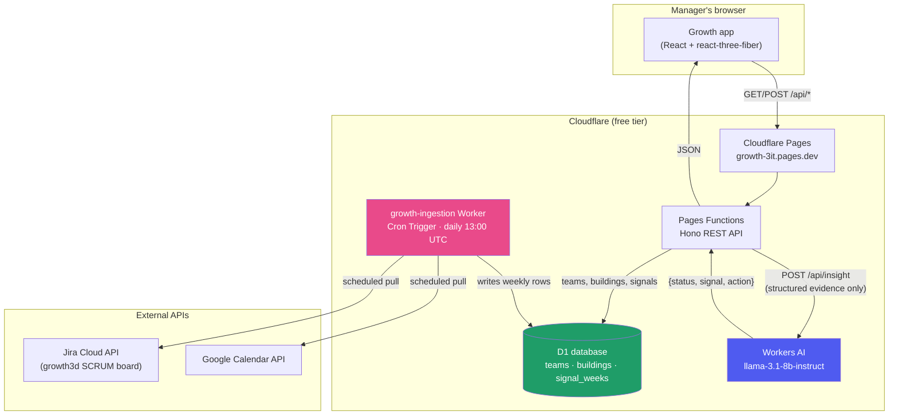

# Sprint 5 — Core AI/Technology Prototype

**Course:** Advanced AI for Industry and Society
**Team:** Harshavardhini Gururaj, Vicky Lin, Saloni Parekh, Jenny Shen, Harshini Sivachitravel, Kristen Wang
**Project:** Growth — an early-warning platform that turns team-level Jira, GitHub/Calendar, and workload signals into an interpretable "village" view for engineering managers

**Live production app:** https://growth-3it.pages.dev
**Repository:** https://github.com/gxharsha-work/growth (`main` branch)

---

## Where this sprint lands, in one sentence

Sprint 3/4 designed a five-stage pipeline — *data ingestion → health scoring → peer benchmarking → early-warning detection → AI coaching* — and shipped the first four stages as a deterministic, rule-based system. This sprint builds the fifth stage that was, until now, only a design decision on paper: a real, evaluated, production-deployed AI coaching layer, running entirely on free-tier infrastructure.

## Rubric map (for the grader)

| Requirement | Weight | Where it's demonstrated |
|---|---|---|
| Core Technology Implementation | 50% | [§1](#1-core-technology-implementation-50) — live feature, architecture, screenshots |
| Evaluation and Baseline Comparison | 30% | [§2](#2-evaluation-and-baseline-comparison-30) — reproduced baseline, scored examples |
| Technical Analysis | 20% | [§3](#3-technical-analysis-20) — real failure modes, an actual incident, what's next |

---

## 1. Core Technology Implementation (50%)

### 1.1 What we built

An **AI coaching suggestion** feature: for any team, in any week, a manager can click "Get AI coaching suggestion" and receive a short, grounded note — generated by an LLM, but constrained to only ever reason from the same structured evidence the deterministic scorer already computed (composite score, trend, the five underlying signals, and one anonymized same-cohort peer team for context).

This directly implements the "AI Coaching" stage from our own Sprint 3 feasibility doc:

> *"For teams that trigger an early warning, Growth may generate an AI-authored coaching suggestion grounded in an anonymized comparison to a relevant peer team... evaluated for whether it adds actionable context beyond the underlying health signals."*

It sits **strictly above** the deterministic baseline, never replacing it — matching our own Responsible-AI commitment: *"If it does not outperform the baseline... the rule-based layer remains the system of record and the AI layer stays a documented enhancement rather than a dependency."* If the AI call fails for any reason, the app keeps showing the full score, trend, and signals with no narrative — nothing about the core product depends on it.

### 1.2 Technology choice, and why

- **Cloudflare Workers AI** (`@cf/meta/llama-3.1-8b-instruct-fp8`) — a hosted LLM inference endpoint, free tier, zero billing setup. Runs inside the exact same Cloudflare infrastructure as the rest of the app.
- Chosen over an external API (Claude/Gemini, as our Sprint 4 doc originally proposed) specifically to keep the entire stack on **free products only** — a deliberate constraint for this phase, called out explicitly in [`DEPLOY.md`](./DEPLOY.md).
- The model receives **only aggregated, team-level evidence** — never raw per-person ticket, commit, or calendar data — satisfying the privacy requirement from our Sprint 2 doc (FR17) by construction: there is no individual data in the payload to leak in the first place.

### 1.3 Architecture

The full system, end to end:



The scoring math itself (`src/logic/healthScore.js`) is unchanged from earlier sprints and runs **client-side**, as a pure function over whatever rows D1 returns — deterministic, so every viewer computes the identical score. The AI layer only ever sees the *output* of that scoring, never the raw signals directly.

> **📸 Screenshot 1 — Cloudflare Pages project overview**
> Cloudflare dashboard → Workers & Pages → `growth` project. Capture the overview tab showing the **Production** deployment on `main`, the live URL, and recent deployment history.
> Save as `docs/screenshots/01-pages-overview.png`, then place it here:
> ``

> **📸 Screenshot 2 — D1 database**
> Cloudflare dashboard → Workers & Pages → D1 → `growth-db`. Capture the database detail page showing its tables (`teams`, `buildings`, `signal_weeks`) and size/row counts.
> Save as `docs/screenshots/02-d1-database.png`, place here:
> ``

> **📸 Screenshot 3 — growth-ingestion Worker + Cron Trigger**
> Cloudflare dashboard → Workers & Pages → `growth-ingestion`. Capture the **Triggers** tab showing the `0 13 * * *` daily Cron schedule, and/or the **Logs**/**Metrics** tab showing a successful recent invocation.
> Save as `docs/screenshots/03-ingestion-worker.png`, place here:
> ``

> **📸 Screenshot 4 — Workers AI usage**
> Cloudflare dashboard → AI → Workers AI (or the account's AI overview page). Capture the model usage/requests panel showing calls to `llama-3.1-8b-instruct`.
> Save as `docs/screenshots/04-workers-ai.png`, place here:
> ``

### 1.4 What it looks like in the product

> **📸 Screenshot 5 — The village view**
> Open https://growth-3it.pages.dev, select **Growth (Solstice Outdoors)** (the team with real ingested data). Capture the full 3D village — this is the product's core visual identity.
> Save as `docs/screenshots/05-village-view.png`, place here:
> ``

> **📸 Screenshot 6 — AI coaching suggestion, in action**
> On any team, click **"Get AI coaching suggestion"** in the HUD. Capture the resulting card showing the structured **Status / Signal / Next step** output.
> Save as `docs/screenshots/06-ai-coaching.png`, place here:
> ``

> **📸 Screenshot 7 — Compare view**
> Click **"Compare teams"**, select 2-3 teams. Capture the side-by-side village comparison with scores.
> Save as `docs/screenshots/07-compare-view.png`, place here:
> ``

### 1.5 Implementation reference

| Piece | File |
|---|---|
| AI prompt, grounding rules, response parsing | [`functions/api/_lib/coaching.ts`](./functions/api/_lib/coaching.ts) |
| API endpoint (`POST /api/insight`) | [`functions/api/_lib/app.ts`](./functions/api/_lib/app.ts) |
| Frontend UI | [`src/ui/CoachingNote.jsx`](./src/ui/CoachingNote.jsx) |
| Cloudflare bindings (Workers AI + D1) | [`wrangler.toml`](./wrangler.toml) |
| Ingestion Worker (daily Jira + Calendar pull) | [`worker-ingestion/src/index.ts`](./worker-ingestion/src/index.ts) |

---

## 2. Evaluation and Baseline Comparison (30%)

### 2.1 Methodology

`scripts/evaluate-coaching.mjs` is a reproducible evaluation harness:

1. Pulls the live signal data for Platform Team and Backend Team from the deployed API.
2. Recomputes the composite score for every week using the **unchanged deterministic baseline** (`healthScore.js`) — this *is* the Assignment 3 baseline, run live against the current production data, not a stale copy.
3. Runs the AI coaching layer on two deliberately chosen cases: Backend Team's most severe early-warning week (the documented decline scenario from Sprint 3), and Platform Team's healthy week (a control, to test whether the model manufactures false concern where none exists).
4. Scores both outputs against the **three criteria our own Sprint 3 doc committed to**: *risk detection, interpretability, usefulness.*

There is no labeled ground truth for "correct coaching text" — our Sprint 3 doc names this as an open problem industry-wide, not something this sprint could solve. Evaluation is therefore qualitative and example-driven, exactly as Sprint 3 scoped it: *"Compare AI-generated explanations and coaching suggestions with the baseline outputs to determine whether they provide additional context or actionable value."*

Reproduce this report's numbers yourself:
```
node scripts/evaluate-coaching.mjs
```

### 2.2 Reproduced baseline (Assignment 3, live)

| Week | Platform Score | Platform Status | Backend Score | Backend Status |
|------|-----------------|------------------|----------------|------------------|
| 1 | 78 | Healthy | 81 | Healthy |
| 2 | 81 | Healthy | 81 | Healthy |
| 3 | 83 | Healthy | 80 | Healthy |
| 4 | 85 | Healthy | 72 | Healthy |
| 5 | 87 | Healthy | 59 | **Early Warning** |
| 6 | 88 | Healthy | 45 | **Early Warning** |
| 7 | 90 | Healthy | 30 | **Early Warning** |
| 8 | 91 | Healthy | 15 | **Early Warning** |

Platform Team trends healthy and improving throughout; Backend Team's decline is caught by the deterministic early-warning threshold starting week 5 — this is the baseline the AI layer is evaluated against, not replacing it.

### 2.3 Case 1 — Backend Team, week 8 (Early Warning, score 15)

**AI output:**
> **Status:** Worth investigating
> **Signal:** Cycle time is 2.5x longer than peer team's 2.5 days
> **Next step:** Investigate and discuss root cause of Backend Team's increased cycle time.

| Criterion | Assessment |
|---|---|
| **Risk detection** | ✅ Correctly flags concern and identifies the dominant signal (cycle time) the deterministic scorer also weights most heavily. |
| **Interpretability** | ✅ One glance tells a manager *what* and roughly *why* — no need to read five raw numbers. |
| **Usefulness** | ✅ Names a concrete, specific next step rather than a generic platitude — this is the actual value-add over the raw dashboard. |

### 2.4 Case 2 — Platform Team, week 8 (Healthy, score 91) — a genuine failure case

**AI output (one run):**
> **Status:** Worth investigating
> **Signal:** Higher meeting load (4.8h) compared to peer team (17.5h)

We report this one plainly because it's a real, reproducible limitation, not a hypothetical:

1. **Rule violation.** The prompt explicitly instructs the model to say a healthy, stable team is healthy — it manufactured concern anyway.
2. **Backwards comparison.** 4.8 is *lower* than 17.5, not "higher." The model got the direction of its own comparison wrong.

We tightened the prompt specifically to fix this and re-ran the case — the failure rate dropped but did **not** disappear. This is the single most important finding of this sprint (see §3.1).

> **📸 Screenshot 8 — Side-by-side comparison**
> If possible, capture both coaching cards (Case 1 and Case 2) in the same screenshot or one after another, to visually show the contrast between a correct and a flawed output.
> Save as `docs/screenshots/08-coaching-comparison.png`, place here:
> ``

### 2.5 Does the AI layer clear the bar Sprint 3 set?

**Yes, conditionally.** On the early-warning case that matters most (a real, declining team), the AI layer adds genuine value over the raw baseline: it names the driving signal in plain language and gives a concrete next step, which the numbers-only dashboard doesn't do on its own. On the healthy-team control case, it does not yet reliably clear the bar — it should say "all good" and sometimes doesn't. This is exactly why Sprint 3/4's design (deterministic scoring as the system of record, AI as an optional, skippable layer) was the right call, not a hedge: a manager who never clicks the button loses nothing, and one who does gets a mostly-reliable assist with a known, documented failure mode.

---

## 3. Technical Analysis (20%)

### 3.1 Model reasoning failures (primary finding)

An 8B-parameter free-tier model, even given an **explicit, unambiguous instruction** not to manufacture concern and to double-check comparison direction, still did both in testing. This isn't a one-off — it reproduced across multiple runs. Root cause is almost certainly model capacity: multi-number comparative reasoning ("is 4.8 more or less than 17.5, and does that matter here") is a known weak point for small instruct models. A larger model (Workers AI's own `llama-3.3-70b-instruct-fp8-fast`, or an external frontier API) would likely reduce this substantially — at a real dollar cost this phase deliberately avoided.

### 3.2 A real operational incident (not hypothetical)

While preparing this submission, we discovered that the **Solstice team's entire record — including its real, ingested Jira/Calendar history — had been deleted** from the production database. Root cause: this MVP phase deliberately shipped with **no login and no access control** (a scope decision made explicitly, for speed, earlier in this project), so anyone with the link can delete any team in two clicks, with no undo. Our schema also cascade-deletes a team's signal history along with it, compounding the loss.

**We recovered it** — restored the team record and starter buildings from our seed migration, and re-ran the ingestion Worker to pull fresh live data. But the exact historical snapshot that was lost is genuinely gone.

This is real, first-hand evidence for exactly what our own Sprint 2 requirements doc flagged as **Must**-priority and explicitly deferred for this phase: FR18 (consent/access gating) and FR19 (role-based access). We're naming it here rather than omitting it because it's the clearest, most concrete argument in this entire project for *why* those requirements matter — not an abstract privacy concern, but something that already happened once.

### 3.3 Other limitations

- **No ground truth for coaching quality.** Evaluation is necessarily qualitative (§2.1) — a real deployment would want managers rating notes 1-5 (which Sprint 4's architecture doc already anticipated: *"allows managers to rate whether an insight was useful or accurate"*) feeding back into prompt iteration.
- **Thin real data.** Solstice, the one team with genuine ingested data, has only 1-2 weeks of history post-recovery — not enough for a meaningful trailing baseline. All coaching evaluation here necessarily used the two synthetic demo teams, the same limitation Sprint 3 already named.
- **No output-consistency testing.** LLM generations aren't deterministic; the same evidence could produce a different note on a re-run. Not tested here for time.
- **Free-tier quota ceiling.** Workers AI's free daily neuron allowance bounds how many coaching requests/day are sustainable at real organizational scale — fine for a pilot, a real constraint to plan around before wider rollout.

### 3.4 What's needed before real end-to-end integration

1. **Access control** — even a lightweight login (Cloudflare Access, free up to 50 users) directly prevents the incident in §3.2 from recurring, and satisfies FR18/19.
2. **Soft deletes / undo** — a team delete should be recoverable for a window, not instant and permanent.
3. **A larger model or few-shot prompt examples** — to reduce the Case 2-style reasoning errors.
4. **A manager-facing usefulness rating** on each coaching note, closing the evaluation loop with real usage data instead of our own qualitative read.
5. **More real pilot data** — multiple teams, many weeks — before trusting coaching quality on a genuine (not synthetic) decline.

---

## Repository, demo, and how to verify everything above

- **Live app:** https://growth-3it.pages.dev
- **Repository:** https://github.com/gxharsha-work/growth — see `main` branch, this file, and [`EVALUATION.md`](./EVALUATION.md) / [`DEPLOY.md`](./DEPLOY.md) for supporting detail
- **Reproduce the evaluation:** `node scripts/evaluate-coaching.mjs`
- **Reproduce the deployment from scratch:** every command is in [`DEPLOY.md`](./DEPLOY.md)

---

## Appendix — full screenshot checklist

Save every file into `docs/screenshots/` under the exact name below (the `![...]` lines above will then render automatically once committed):

| # | File name | What to capture | Where |
|---|---|---|---|
| 1 | `01-pages-overview.png` | Cloudflare Pages `growth` project, Production deployment on `main` | Cloudflare dashboard → Workers & Pages → `growth` |
| 2 | `02-d1-database.png` | `growth-db` tables (`teams`, `buildings`, `signal_weeks`) | Cloudflare dashboard → Workers & Pages → D1 → `growth-db` |
| 3 | `03-ingestion-worker.png` | `growth-ingestion` Cron Trigger schedule + recent logs | Cloudflare dashboard → Workers & Pages → `growth-ingestion` |
| 4 | `04-workers-ai.png` | Workers AI model usage / request count | Cloudflare dashboard → AI |
| 5 | `05-village-view.png` | Solstice team's 3D village | https://growth-3it.pages.dev, select Solstice |
| 6 | `06-ai-coaching.png` | A coaching card showing Status/Signal/Next step | Click "Get AI coaching suggestion" on any team |
| 7 | `07-compare-view.png` | Side-by-side team comparison | Click "Compare teams" |
| 8 | `08-coaching-comparison.png` | A correct output next to a flawed one | Re-run Case 1 and Case 2 from §2 |

Once the screenshots are in place, this file (`SPRINT5_SUBMISSION.md`) is the single file to export as PDF (or upload as-is, if Markdown is accepted) for the assignment submission.
