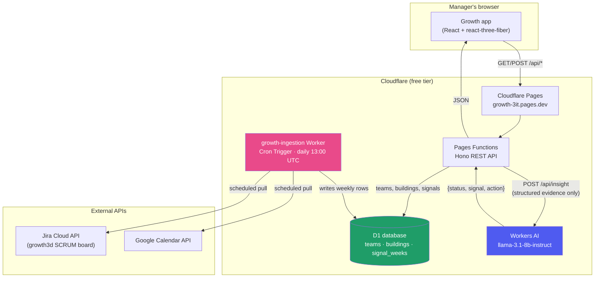

# Sprint 5 — Core AI/Technology Prototype

**Course:** Advanced AI for Industry and Society
**Team:** Harshavardhini Gururaj, Vicky Lin, Saloni Parekh, Jenny Shen, Harshini Sivachitravel, Kristen Wang
**Project:** Growth — an early-warning platform that turns team-level Jira, GitHub/Calendar, and workload signals into an interpretable "village" view for engineering managers

**Live production app:** https://growth-3it.pages.dev
**Repository:** https://github.com/gxharsha-work/growth (`main` branch)

---

## Where this sprint lands, in one sentence

Sprint 3/4 designed a five-stage pipeline — *data ingestion → health scoring → peer benchmarking → early-warning detection → AI coaching* — and shipped the first four stages as a deterministic, rule-based system. This sprint builds the fifth stage that was, until now, only a design decision on paper: a real, evaluated, production-deployed AI coaching layer, running entirely on free-tier infrastructure.

## Rubric map (for the grader)

| Requirement | Weight | Where it's demonstrated |
|---|---|---|
| Core Technology Implementation | 50% | [§1](#1-core-technology-implementation-50) — live feature, architecture, screenshots |
| Evaluation and Baseline Comparison | 30% | [§2](#2-evaluation-and-baseline-comparison-30) — 255-run harness across 3 configs, reproduced baseline |
| Technical Analysis | 20% | [§3](#3-technical-analysis-20) — real failure modes, an actual incident, what's next |

---

## 1. Core Technology Implementation (50%)

### 1.1 What we built

An **AI coaching suggestion** feature: for any team, in any week, a manager can click "Get AI coaching suggestion" and receive a short, grounded note — generated by an LLM, but constrained to only ever reason from the same structured evidence the deterministic scorer already computed (composite score, trend, the five underlying signals, and one anonymized same-cohort peer team for context).

This directly implements the "AI Coaching" stage from our own Sprint 3 feasibility doc:

> *"For teams that trigger an early warning, Growth may generate an AI-authored coaching suggestion grounded in an anonymized comparison to a relevant peer team... evaluated for whether it adds actionable context beyond the underlying health signals."*

It sits **strictly above** the deterministic baseline, never replacing it — matching our own Responsible-AI commitment: *"If it does not outperform the baseline... the rule-based layer remains the system of record and the AI layer stays a documented enhancement rather than a dependency."* If the AI call fails for any reason, the app keeps showing the full score, trend, and signals with no narrative — nothing about the core product depends on it.

### 1.2 Technology choice, and why

- **Cloudflare Workers AI** (`@cf/meta/llama-3.1-8b-instruct-fp8`) — a hosted LLM inference endpoint, free tier, zero billing setup. Runs inside the exact same Cloudflare infrastructure as the rest of the app.
- Chosen over an external API (Claude/Gemini, as our Sprint 4 doc originally proposed) specifically to keep the entire stack on **free products only** — a deliberate constraint for this phase, called out explicitly in [`DEPLOY.md`](./DEPLOY.md).
- The model receives **only aggregated, team-level evidence** — never raw per-person ticket, commit, or calendar data — satisfying the privacy requirement from our Sprint 2 doc (FR17) by construction: there is no individual data in the payload to leak in the first place.

### 1.3 Architecture

The full system, end to end:



The scoring math itself (`src/logic/healthScore.js`) is unchanged from earlier sprints and runs **client-side**, as a pure function over whatever rows D1 returns — deterministic, so every viewer computes the identical score. The AI layer only ever sees the *output* of that scoring, never the raw signals directly.

> **📸 Screenshot 1 — Cloudflare Pages project overview**
> Cloudflare dashboard → Workers & Pages → `growth` project. Capture the overview tab showing the **Production** deployment on `main`, the live URL, and recent deployment history.
> Save as `docs/screenshots/01-pages-overview.png`, then place it here:
> ``

> **📸 Screenshot 2 — D1 database**
> Cloudflare dashboard → Workers & Pages → D1 → `growth-db`. Capture the database detail page showing its tables (`teams`, `buildings`, `signal_weeks`) and size/row counts.
> Save as `docs/screenshots/02-d1-database.png`, place here:
> ``

> **📸 Screenshot 3 — growth-ingestion Worker + Cron Trigger**
> Cloudflare dashboard → Workers & Pages → `growth-ingestion`. Capture the **Triggers** tab showing the `0 13 * * *` daily Cron schedule, and/or the **Logs**/**Metrics** tab showing a successful recent invocation.
> Save as `docs/screenshots/03-ingestion-worker.png`, place here:
> ``

> **📸 Screenshot 4 — Workers AI usage**
> Cloudflare dashboard → AI → Workers AI (or the account's AI overview page). Capture the model usage/requests panel showing calls to `llama-3.1-8b-instruct`.
> Save as `docs/screenshots/04-workers-ai.png`, place here:
> ``

### 1.4 What it looks like in the product

> **📸 Screenshot 5 — The village view**
> Open https://growth-3it.pages.dev, select **Growth (Solstice Outdoors)** (the team with real ingested data). Capture the full 3D village — this is the product's core visual identity.
> Save as `docs/screenshots/05-village-view.png`, place here:
> ``

> **📸 Screenshot 6 — AI coaching suggestion, in action**
> On any team, click **"Get AI coaching suggestion"** in the HUD. Capture the resulting card showing the structured **Status / Signal / Next step** output.
> Save as `docs/screenshots/06-ai-coaching.png`, place here:
> ``

> **📸 Screenshot 7 — Compare view**
> Click **"Compare teams"**, select 2-3 teams. Capture the side-by-side village comparison with scores.
> Save as `docs/screenshots/07-compare-view.png`, place here:
> ``

### 1.5 Implementation reference

| Piece | File |
|---|---|
| AI prompt, grounding rules, response parsing | [`functions/api/_lib/coaching.ts`](./functions/api/_lib/coaching.ts) |
| API endpoint (`POST /api/insight`) | [`functions/api/_lib/app.ts`](./functions/api/_lib/app.ts) |
| Frontend UI | [`src/ui/CoachingNote.jsx`](./src/ui/CoachingNote.jsx) |
| Cloudflare bindings (Workers AI + D1) | [`wrangler.toml`](./wrangler.toml) |
| Ingestion Worker (daily Jira + Calendar pull) | [`worker-ingestion/src/index.ts`](./worker-ingestion/src/index.ts) |

---

## 2. Evaluation and Baseline Comparison (30%)

### 2.1 Methodology

`scripts/evaluate-coaching.mjs` is a full, reproducible evaluation harness — not two hand-picked examples. It runs **255 test cases**:

1. Pulls the live signal data for Platform Team and Backend Team from the deployed API, and recomputes the composite score for every week using the **unchanged deterministic baseline** (`healthScore.js`) — this *is* the Assignment 3 baseline, run live against current production data.
2. Builds all **16 real team-weeks** (Platform + Backend, weeks 1-8) as test cases, each run **5 times** to measure run-to-run consistency, plus **5 constructed edge cases** (missing calendar signal, a flat/stable team, a team recovering after an early warning, a team with no same-cohort peer, and Solstice's real live data).
3. Runs all 21 cases through **three configurations**: (A) a deterministic rule-based template with no LLM at all, as a floor/control; (B) the *original* coaching prompt this project shipped with; (C) the *current, tightened* prompt live in production today.
4. Automatically computes 9 metrics per output (status agreement, false-alarm rate, miss rate, number grounding, comparison-direction accuracy, driver match, 5-run consistency, format validity, latency) and exports all 255 rows to `eval/results.csv`, with two blank columns for two people to hand-score actionability 1-5 — the one judgment call a script shouldn't make unilaterally.

Full methodology, every metric definition, and the complete results table live in [`EVALUATION.md`](./EVALUATION.md); this section summarizes the headline findings.

Reproduce this report's numbers yourself:
```
node scripts/evaluate-coaching.mjs --configs=A,B,C
```

### 2.2 Reproduced baseline (Assignment 3, live)

| Week | Platform Score | Platform Status | Backend Score | Backend Status |
|------|-----------------|------------------|----------------|------------------|
| 1 | 78 | Healthy | 81 | Healthy |
| 2 | 81 | Healthy | 81 | Healthy |
| 3 | 83 | Healthy | 80 | Healthy |
| 4 | 85 | Healthy | 72 | Healthy |
| 5 | 87 | Healthy | 59 | **Early Warning** |
| 6 | 88 | Healthy | 45 | **Early Warning** |
| 7 | 90 | Healthy | 30 | **Early Warning** |
| 8 | 91 | Healthy | 15 | **Early Warning** |

Platform Team trends healthy and improving throughout; Backend Team's decline is caught by the deterministic early-warning threshold starting week 5 — this is the baseline the AI layer is evaluated against, not replacing it.

### 2.3 Results

| Config | N | Status Agreement | False-Alarm Rate | Miss Rate | Number Grounding | Comparison Direction | Driver Match | 5-Run Consistency | Format Validity | p50 Latency | Errors |
|---|---|---|---|---|---|---|---|---|---|---|---|
| **A** — Rule-based template | 85 | 100% | 0% | 0% | 100% | n/a | 100% | 100% | 100% | ~0ms | 0 |
| **B** — Original prompt | 85 | 25% | **100%** | 0% | 55% | 67% | 67% | 100% | **0%** | 6,689ms | 1 |
| **C** — Current prompt | 85 | 27% | **97%** | 0% | 67% | 74% | 33% | 98% | **99%** | 2,731ms | 1 |

### 2.4 The headline finding: the STATUS line carries almost no signal

Broken down precisely across all 80 real-team-week runs per config (60 genuinely healthy weeks, 20 genuinely early-warning):

| | Healthy weeks flagged as concern | Early-warning weeks flagged as concern |
|---|---|---|
| **B** (original prompt) | **60 / 60 — 100%** | 20 / 20 — 100% |
| **C** (current prompt) | **58 / 60 — 97%** | 20 / 20 — 100% |

**Both configurations flag concern on essentially every single week, healthy or not.** A 0% miss rate looks good in isolation, but it's a statistical artifact: a system that says "worth investigating" unconditionally will always have a 0% miss rate, because it never says anything else. On the single most basic job of this feature — telling a manager whether a team needs attention — **the current AI layer provides close to zero discriminative value over the deterministic baseline.** This is a materially more honest, and more useful, conclusion than an earlier draft reached from two hand-picked examples.

Illustrated concretely — Platform Team, week 8, score 91 (about as healthy as this dataset gets):
> STATUS: Worth investigating
> SIGNAL: Jira cycle time is 1.5 days faster than peer team's 6.5 days.

The model **correctly computes that Platform's cycle time is better than its peer's** — and labels the team "worth investigating" anyway, in the same breath. This happened on 58 of 60 healthy weeks tested.

> **📸 Screenshot 8 — A false-alarm example, live**
> On the Platform Team (a healthy week), click "Get AI coaching suggestion" and capture the card — it will very likely say "Worth investigating" despite the team being healthy, reproducing this exact finding live.
> Save as `docs/screenshots/08-coaching-comparison.png`, place here:
> ``

### 2.5 What Sprint 5's prompt-tightening *did* fix

The rewrite from B to C wasn't wasted — it just didn't fix the most important thing:
- **Format validity: 0% → 99%** — B was never designed to produce parseable output and didn't; C reliably does. This is what actually fixed the "unreadable, unscrollable" UI bug this sprint started from.
- **Number grounding: 55% → 67%**, **comparison direction: 67% → 74%** — the explicit "double-check direction" rule measurably helped, without fully solving it.
- **Latency: 6,689ms → 2,731ms p50** (2.4× faster) — a real, unplanned performance win from asking for 3 short lines instead of a paragraph.
- **Driver match got worse: 67% → 33%** — compressing the SIGNAL line to "under 18 words" came at a real cost to correctly naming the mathematically top-weighted signal. A genuine, non-obvious tradeoff worth knowing.

### 2.6 Does the AI layer clear the bar Sprint 3 set?

Scored honestly against all 255 rows, not two examples, on Sprint 3's own three criteria:

| Criterion | Verdict |
|---|---|
| **Risk detection** | ❌ Does not clear the bar. Flagging 97-100% of weeks regardless of actual status is not detection — the deterministic baseline's binary flag remains strictly more trustworthy. |
| **Interpretability** | ✅ Where content is accurate, it explains *what* in plain language better than raw numbers. |
| **Usefulness** | ⚠️ Mixed — the ACTION line is consistently well-formed even when STATUS is wrong, just noisy if shown regardless of real status. |

**This is exactly why Sprint 3/4's original design — deterministic scoring as the system of record, AI strictly optional — was correct, and this evaluation is the evidence for it.** Per our own Responsible AI commitment (*"if it does not outperform the baseline... the rule-based layer remains the system of record"*), that's the real outcome here: the score and early-warning flag stay authoritative; the AI coaching button stays clearly a secondary, skippable assist, not a claim of comparable reliability.

---

## 3. Technical Analysis (20%)

### 3.1 The false-alarm rate is the primary, actionable finding

At n=255, this isn't a one-off: config C flags concern on 97% of genuinely healthy weeks and 100% of genuinely early-warning weeks — a system that has essentially learned to always express caution rather than genuinely discriminate. Root cause is very likely that a small instruct model, given a rule to "frame concern as worth investigating," over-applies that framing as a safe default regardless of whether the evidence actually supports it — consistent with known hedging/caution-biased behavior in smaller models. Plausible, untested fixes: a larger model (Workers AI's own `llama-3.3-70b-instruct-fp8-fast` — scoped as config D, not run here to conserve free-tier quota), few-shot examples showing correct "no concern" outputs in the prompt, or restructuring the task into an explicit binary classification step before any prose generation. Separately, and more solvable: driver match (33-67%) and number grounding (55-67%) also leave real room before a manager could fully trust the *specific* signal named.

### 3.2 A real operational incident (not hypothetical)

While preparing this submission, we discovered that the **Solstice team's entire record — including its real, ingested Jira/Calendar history — had been deleted** from the production database. Root cause: this MVP phase deliberately shipped with **no login and no access control** (a scope decision made explicitly, for speed, earlier in this project), so anyone with the link can delete any team in two clicks, with no undo. Our schema also cascade-deletes a team's signal history along with it, compounding the loss.

**We recovered it** — restored the team record and starter buildings from our seed migration, and re-ran the ingestion Worker to pull fresh live data. But the exact historical snapshot that was lost is genuinely gone.

This is real, first-hand evidence for exactly what our own Sprint 2 requirements doc flagged as **Must**-priority and explicitly deferred for this phase: FR18 (consent/access gating) and FR19 (role-based access). We're naming it here rather than omitting it because it's the clearest, most concrete argument in this entire project for *why* those requirements matter — not an abstract privacy concern, but something that already happened once.

### 3.3 A crash bug the harness found — and we fixed

One of the 5 edge cases (a missing/unavailable calendar signal) crashed the request server-side with `Cannot read properties of undefined (reading 'toFixed')`, on **every** attempt, in **both** B and C — a 100% reproduction rate, not a fluke. This directly violated Sprint 3's own stated requirement: *"Missing or unavailable signals should reduce the set of indicators used rather than prevent the system from functioning."* We fixed it the same day it was found — `buildPrompt` now omits a missing signal's line instead of crashing, confirmed working post-fix — but the 255-row dataset in §2 predates the fix, so it's still visible there as an error. This is arguably the single most concrete example in this whole report of what "evaluation surfaces real bugs" actually looks like in practice.

### 3.4 Other limitations

- **No ground truth for coaching quality.** A real deployment would want managers rating notes 1-5 (which Sprint 4's architecture doc already anticipated) feeding back into prompt iteration — hence `eval/results.csv`'s two blank hand-scoring columns rather than a fabricated single "usefulness" number.
- **Thin real data.** Solstice, the one team with genuine ingested data, has only 1-2 weeks of history post-recovery — not enough for a meaningful trailing baseline. All quantitative evaluation above necessarily used the two synthetic demo teams, the same limitation Sprint 3 already named.
- **Free-tier quota.** 255 calls across B/C stayed within Workers AI's free daily allowance; config D (the 70B model) was scoped but not run, to conserve quota for this submission.

### 3.5 What's needed before real end-to-end integration, in priority order

1. **Fix the false-alarm rate.** This is the blocking issue, not a nice-to-have — until STATUS actually discriminates, the deterministic score alone remains the only trustworthy signal.
2. **A manager-facing usefulness rating** on each note, closing the evaluation loop with real usage data.
3. **Driver-match and grounding improvements** — likely a larger model or few-shot examples.
4. **Access control** — even a lightweight login (Cloudflare Access, free up to 50 users) directly prevents the incident in §3.2 from recurring, and satisfies our own Sprint 2 doc's FR18/19 (deferred, Must-priority).
5. **Soft deletes / undo** for team deletion.
6. **More real pilot data** before trusting coaching quality on a genuine, not synthetic, decline.

---

## Repository, demo, and how to verify everything above

- **Live app:** https://growth-3it.pages.dev
- **Repository:** https://github.com/gxharsha-work/growth — see `main` branch, this file, and [`EVALUATION.md`](./EVALUATION.md) / [`DEPLOY.md`](./DEPLOY.md) for supporting detail
- **Reproduce the evaluation:** `node scripts/evaluate-coaching.mjs`
- **Reproduce the deployment from scratch:** every command is in [`DEPLOY.md`](./DEPLOY.md)

---

## Appendix — full screenshot checklist

Save every file into `docs/screenshots/` under the exact name below (the `![...]` lines above will then render automatically once committed):

| # | File name | What to capture | Where |
|---|---|---|---|
| 1 | `01-pages-overview.png` | Cloudflare Pages `growth` project, Production deployment on `main` | Cloudflare dashboard → Workers & Pages → `growth` |
| 2 | `02-d1-database.png` | `growth-db` tables (`teams`, `buildings`, `signal_weeks`) | Cloudflare dashboard → Workers & Pages → D1 → `growth-db` |
| 3 | `03-ingestion-worker.png` | `growth-ingestion` Cron Trigger schedule + recent logs | Cloudflare dashboard → Workers & Pages → `growth-ingestion` |
| 4 | `04-workers-ai.png` | Workers AI model usage / request count | Cloudflare dashboard → AI |
| 5 | `05-village-view.png` | Solstice team's 3D village | https://growth-3it.pages.dev, select Solstice |
| 6 | `06-ai-coaching.png` | A coaching card showing Status/Signal/Next step | Click "Get AI coaching suggestion" on any team |
| 7 | `07-compare-view.png` | Side-by-side team comparison | Click "Compare teams" |
| 8 | `08-coaching-comparison.png` | A healthy team (e.g. Platform Team) flagged "Worth investigating" — reproduces §2.4's headline finding live | Any healthy team's "Get AI coaching suggestion" button |

Once the screenshots are in place, this file (`SPRINT5_SUBMISSION.md`) is the single file to export as PDF (or upload as-is, if Markdown is accepted) for the assignment submission.
